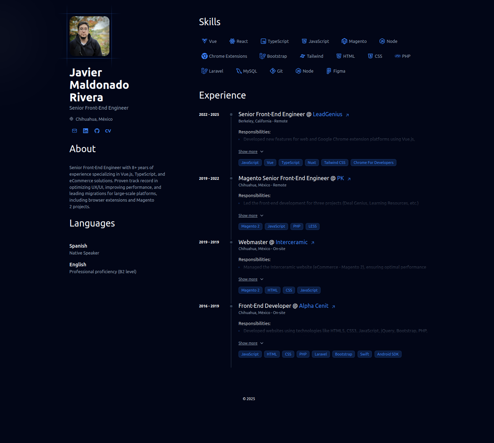

## Javier Maldonado Rivera CV



## 📄 About

This project is refactored from the original [**dev-portfolio**](https://github.com/Smilesharks/dev-portfolio) project, thanks for his work.

## 🛠️ Stack

- [**Astro**](https://astro.build/) - The next-gen web framework.
- [**Typescript**](https://www.typescriptlang.org/) - JavaScript with type syntax.

## 🚀 Getting Started

### 1. Use this Repo as an Astro Project Template

- I use [npm](https://docs.npmjs.com/) as my package manager.

```bash
# Enable npm on MacOS, WSL & Linux:
npm install -g npm@latest
```

# Initialize the project
```bash
git clone https://github.com/JavierMaldonadoR/javiermaldonadorivera.com.git
cd javiermaldonadorivera.com
npm install
```
### 2. Add Your Content:

Edit the `cv.json` file to create your own Portfolio/CV.

### 3. Launch the Development Server:

```bash
# Enjoy the results
npm dev
```
1. Open [**http://localhost:4321**](http://localhost:4321/) in your browser to view the result 🚀

### 4. Customizable colors:
Change the data-theme of `cv.json` and choose one of the color themes defined in theme.css, red, blue, green, cyber and default, with its variants in dark mode, or create your own.

## 🧞 Commands

|     | Command         | Action                                                                       |
| :-- | :-------------- | :--------------------------------------------------------------------------- |
| ⚙️  | `dev` o `start` | Launches a local development server at `localhost:4321`.                   |
| ⚙️  | `build`         | Checks for errors and creates a production build in `./dist/`. |
| ⚙️  | `preview`       | Local preview at `localhost:4321`                                       |
